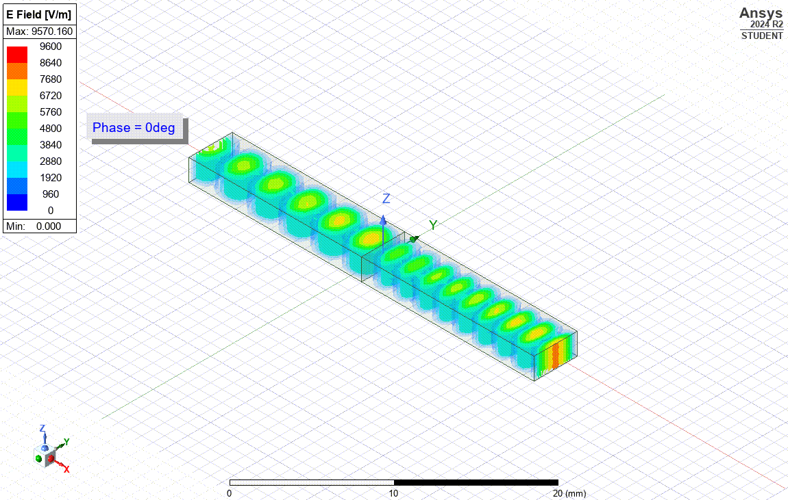

Here's a structured step-by-step guide based on the video transcript for analyzing a **Rectangular Stacked Waveguide using Optimetrics in Ansys HFSS**:

---

### **Step-by-Step Guide for Rectangular Stacked Waveguide Analysis in HFSS**
#### **1. Open HFSS in Ansys Electronics Desktop (AEDT)**
   - Launch **HFSS** inside **AEDT**.
   - Use the default **millimeter (mm)** units.

#### **2. Define the Rectangular Waveguide Geometry**
   - **Create a Box**:
     - Open the **3D Modeler** window.
     - Click on **"Create Box"** and define the dimensions using variables:
       - **X size (Length)**
       - **Y size (Width)**
       - **Z size (Height)**
   - Edit these dimensions and enter variable names:
     - Length → `length`
     - Width → `width`
     - Height → `height`
   - Click **OK** to accept the variables.

#### **3. View and Edit Model Variables**
   - Check the variables under **Project Manager → HFSS Design**.
   - To edit or add variables:
     - Right-click **HFSS Design** → Select **Design Properties**.
     - Click **"Add"** to define new variables.

#### **4. Define Material Properties Using Project Variables**
   - Right-click **Project Manager** → Select **Project Variables**.
   - Click **"Add"** and define:
     - `eps_r1` (Relative permittivity for the first dielectric).
     - `eps_r2` (Relative permittivity for the second dielectric).
   - Click **OK** to accept changes.
   - The `$` symbol before a variable name (e.g., `$eps_r1`) indicates a **Project Variable**.

#### **5. Assign Dielectric Materials to the Waveguide**
   - Double-click on **Box1** and rename it to `wg_cavity1`.
   - Set the **Material**:
     - Browse to **FR4_epoxy**.
     - Click **"Clone Material"** → Name it `my_FR4_1`.
     - Assign **Relative Permittivity = $eps_r1`.
     - Click **OK** to save the material.
   - Adjust **Material Transparency** for better visualization.

#### **6. Create the Stacked Structure (Duplicate the Waveguide)**
   - Right-click on `wg_cavity1` → Select **Edit → Duplicate Along Line**.
   - Select **X min face center → X max face center**.
   - Ensure the movement is along **X-direction**.
   - Rename the duplicated object `waveguide_cavity1_1` → `waveguide_cavity2`.
   - Assign **Material = my_FR4_2** (with `$eps_r2`).

#### **7. Assign Wave Port Excitation**
   - Define **wave ports** along the **X-axis** for signal excitation.

#### **8. Setup Solution and Frequency Sweep**
   - **Add Solution Setup**:
     - Define analysis parameters (frequency range, adaptive meshing, etc.).
   - **Add Frequency Sweep**:
     - Set the start, stop, and step size for frequency analysis.

#### **9. Perform a Parametric Sweep**
   - Right-click **Optimetrics** → Select **Add → Parametric Sweep**.
   - Add a new sweep variable:
     - Select `$eps_r1`.
     - Define **Start, Stop, and Step size**.
   - Click **OK** to apply the sweep.

#### **10. Validate and Run the Simulation**
   - Click **Validate** (big green button).
   - Run the **Analyze** process.
   - Wait for the simulation to complete.

#### **11. Analyze Results**
   - **Phase Constant Plot**:
     - View **cutoff frequencies** of different waveguide modes.
   - **Electric Field Distribution**:
     - Check variations in **E-field** magnitude inside the waveguide.

#### **12. Center the Coordinate System for Better Visualization**
   - **Create a New Local Coordinate System**:
     - Click **Draw → Offset Origin**.
     - Select **Center of the interface** between two dielectrics.
     - Rename it as `new_CS`.
   - Expand **Planes** → Select **XZ & YZ Planes**.
   - Right-click → Plot **Electric Field Magnitude**.

#### **13. Observe Electric Field Distribution**
   - Notice the **E-field magnitude decrease** as permittivity increases.
   - Higher permittivity **increases material impedance** to electric fields.

---

### **Summary**
- This guide shows **how to model a stacked rectangular waveguide** in **HFSS using Optimetrics**.
- It covers **defining geometry, material properties, solution setup, parametric sweeps, and analyzing simulation results**.
- Key observation: **Higher dielectric permittivity reduces the electric field magnitude** inside the waveguide.

Let me know if you need further clarification or a detailed explanation of any step! 🚀

---
Rectangular Stacked Waveguide Analysis Using Optimetrics in Ansys HFSS - YouTube
https://www.youtube.com/watch?v=gAH1NTXgD44

Transcript:
(00:09) And welcome and welcome to this additional video introducing HFSS in the student version of the Ansys Electronics Desktop or AEDT for short and in our previous video we had analyzed a simple dielectric filled rectangular waveguide by using explicit dimensions for the cavity. In this video, we are going to now explore the characteristics of a stacked waveguide and using the optimetrics feature of AEDT.
(00:47) And what we'll do is we will define variables for the dimensions of the cavity as well as for the material properties of the inner dielectric. So, as the name denotes stacked waveguides that infers that more than one dielectric material fills the inside cavity of the waveguide. So, let's get started and let's see how we do this inside of HFSS.
(01:12) So, here is the interface of the tool and has an empty HFSS design and we're going to use the default units which happens to be millimeters. Let's go ahead and draw a box in 3D modeler window and we'll use width, height and length as the model variables for the dimensions of the cavity and in the history tree lets double click on the create box and edit it's dimensions.
(01:37) Enter length in the cell that is next to the X size and click enter. A new dialogue box appears and ask to you define what is X size. and to add a variable to the model object. Give the dimension value as shown and note the columns unit type, units and type for this new variable and local variables are only available within the HFSS design for which they're defined.
(02:03) So, now go ahead click ok to accept the variable. Enter width in the cell next to Y size and click enter. Give the dimension value as shown. Click ok to accept this variable. Enter in height in the cell next to Z size and click enter. Give the dimension value as shown and click ok to accept this variable. click ok to accept all three variables that defines cavity and to close the dialogue box.
(02:29) For quick check you can view variables you just created. and edit them. You can do this by clicking on the HFSS design in the project manager window and you can view the properties box and you should see the list of the variables and note we defined it added the variables while we created the model geometry.
(02:47) But you can also define the variables before you start creating geometry and to do this initially creating the variables go to the project manager window and right mouse click on the HFSS design. Select design properties and now displays all the variables created so far. Go ahead click on add to add a variable and to use when you needed.
(03:13) And this is yet another way to create and view model variables. So, variables can also be used for the material properties and since materials are common to all models within a project. This can be achieved by using project variables. So, let's now add a project variable for the relative permittivity property of some material.
(03:37) So, in the project manager window right mouse click on the project and select project variables and in that popup box click add and enter the name as eps_r1 and use the values as shown below. Click on ok to accept the changes. Now you noted that there is $ sign symbol that’s appended to the prefixed the name of the project variable and this is the indicator for you that this variable is a project variable and used throughout all the models that's in a design.
(04:09) So, let's add one more project variable eps_r2 and use this value as shown below. Now close the project variables window and in that modeler tree window double click on box1. Enter the name as wg_cavity1 and click cell next to material and select and edit and browse to some dielectric say FR4 and we can select FR4_epoxy.
(04:35) Now we can use this dielectric material to create a new custom material set. Click on clone material and this creates a custom material with the FR4 epoxy defaults and in the pop up window under the name input put my_FR4_1. Enter the relative permittivity with the project variable $eps_r1. Click ok to accept your newly created custom material for the dielectric for this waveguide cavity.
(05:07) Go ahead edit the material transparency make it lighter so you can see the fields that are plotted. Now duplicate this rectangular cavity to create a stacked and you do this by right mouse clicking and select edit then duplicate along line and click on that X min face center and then on the X face max center to duplicate the cavity.
(05:30) You can hold down the X key to make sure you are only moving in the X direction Notice the command item duplicate along line is created under the waveguide_cavity1. Now to duplicate command automatically creates a new object with the same name of the duplicated object with an appended '_1'. So, now our new object is waveguide_cavity1_1.
(05:55) Let's rename it to waveguide_cavity2. Assign it another custom material with the permittivity set to $ sign eps_r2. Again change the color so you can easily identify the two different dielectrics in the waveguide. Assign the wave port excitations along the X axis. Add a solution setup as shown along with a frequency sweep.
(06:18) Now let's also add a parametric sweep for the materials and in the project manager window right mouse click on the optimetrics category and select add and then parametric and in that popup dialogue box click on add. One more window pops up and in that drop down text box that's named variable you'll see all of the design variables that have been created.
(06:41) Select $eps_r1 do a linear sweep. Enter the value for the start stop and the step size as shown below and click on add in the middle that dialogue box to accept this parametric sweep and now the sweep appears also on the right side column and you can define additional parametric sweeps but let's only use one for this video.
(07:03) Click ok to close this box and to continue and I am going to that table tab and this will allow to view the specific values in the sweep you just created and this comes in handy when you have defined several different parametric sweeps as well as if you used couple of variables. Go to the options tab and click to save the fields and the mesh and this is so that you can plot the fields for all of the variations in that parameter.
(07:30) Now we are all set to simulate. Check that validate big green validate checkbox go ahead and analyze and once the simulation is done we can view the results. Here is the phase constant plot for port 1 with the markers denoting the cut off frequencies cut off frequencies of the different mode in that waveguide.
(07:48) You can also view these plots for all the values in that parametric sweep for eps_r1 and in the report window of that rectangular plot of phase constant for port 1 click on the families tab and make sure you select all the values of eps_r1. Click on new report. See the variation of that cut off frequency for each of the modes as well.
(08:16) Let's also view the electric field plot in the center planes of that waveguide. Now our global coordinate system is not centered. So, let's go ahead and create a new local coordinate system and that'll help us create centered plots and in that draw tab click on offset origin and select the center of that common face between the two waveguide dielectrics and then you can view this newly created coordinate system in the model tree with the name relative CS1 and you can really edit that name and call it new_CS
(08:52) for the coordinate system. Expand planes and select both the XZ and YZ planes of that new coordinate system. Right mouse click to plot the magnitude of the electric field and so notice the decrease in the magnitude of the electric field in the waveguide cavity as it goes from a lower value to a higher value of relative permittivity and its really nice to see this concept the higher the material permittivity the greater the resistance or impedance of that material to E field So, thank you for watching this video
(09:26) that shows you how to create and analyze that rectangular stacked waveguide using a model and project variables So, to find out more information on how to use HFSS or any of the Ansys simulation tools go ahead visit ansys.com/courses today.
